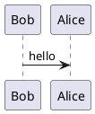

---

# ─── 由 export-posts.mjs 从数据库导出 ────────────────

title: typora第三方插件
slug: typora第三方插件
status: published
publishedAt: 2026-05-22
publishAt: 2026-05-22
authorName: Kiwi
category: 新的功能
tags: ["功能"]

---

这是Typora的第三方插件扩展菜单，这些插件都是用来给Markdown文档增加可视化、图表、交互和特殊排版能力的。下面逐个给你讲清楚用途👇

---

## 📋 项目管理/信息展示类

### 1. Kanban

- **用途**：在Markdown里直接渲染**看板视图**，用不同列（如待办/进行中/已完成）管理任务，非常适合项目管理、任务追踪。
- **效果**：纯文本语法就能生成可视化的任务看板，告别表格，更直观。

```kanban
use strict
# 怎么使用(H1大标题)

## Grammar
* 常用 (H1为大标题\r\nh2)
* General (H1: Kanban title\nH2: Kanban Board\nList: Kanban Task)
- 使用 (这里面可以填写md语法,需要写在英文括号里)
- Style (Supports Markdown inline styles: **bold**, *italic*, `code`, ~~delete~~,) ([link](https://github.com/obgnail/typora_plugin)), ()
- Strict Mode (Use `use strict` on the first line to enforce strict mode; syntax errors will not be ignored.)
## 第二版
- Unlimited Quantity (Kanban boards and tasks are infinitely scalable.)
- Customizable Color Scheme (Customize colors in settings.)
- Long Task Lists (Scroll task lists using the mouse wheel below the Kanban board.)
- Many Kanban Boards (Scroll horizontally using Ctrl+mouse wheel.)
## 第三版
```

### 2. Timeline

- **用途**：制作**时间线/历程图**，用文字语法展示事件发展顺序，适合写项目里程碑、个人经历、历史事件。
- **效果**：把纯文本的时间点自动排成带箭头的时间轴，比列表更有叙事感。

```timeline
# Timeline Title (H1)

## 2022-10-01
### Event Description (H3-H6)
Supports basic Markdown:
- Unordered list item 1
- Unordered list item 2
**bold**, *italic*, `code`, ~~delete~~, [link](https://github.com/obgnail/typora_plugin), 
---
Code blocks are not supported (nested code blocks are discouraged)

## 2023-10-01
Custom syntax; use with caution.
```

### 3. Calendar

- **用途**：在文档里嵌入**交互式日历/日程表**，可以标记事件、安排计划，适合做周报、项目排期。
- **效果**：渲染成可视化日历视图，支持点击和事件高亮。

```calendar
// ==BlockCodeConfig==
// @width            auto
// @height           800px
// @backgroundColor  transparent
// ==/BlockCodeConfig==

// Built-in variables:
//   1. calendar: calendar instance
//   2. Calendar: Calendar class
//   3. option:   calendar option object
//   4. this:     calendar plugin instance
// Examples: https://nhn.github.io/tui.calendar/latest/tutorial-06-daily-view
// API:      https://github.com/nhn/tui.calendar/blob/main/docs/en/apis/options.md
// NOTE:     Code within this block will be evaluated. Exercise caution

const today = new Date()
const yesterday = new Date(today.getTime() - 24 * 60 * 60 * 1000)
const nextMonth = new Date(today.getFullYear(), today.getMonth() + 1, 1)

option = {defaultView: 'week'}
calendar.createEvents([
    {id: 'event1', calendarId: 'cal2', title: 'meeting', start: yesterday, end: today},
    {id: 'event2', calendarId: 'cal1', title: 'appointment', start: yesterday, end: nextMonth},
])
```

---

## 📊 数据可视化类

### 4. Echarts

- **用途**：嵌入**百度ECharts图表**，支持折线图、柱状图、饼图、雷达图等几乎所有统计图表。
- **用法**：在代码块里写JSON配置，直接渲染出可交互的图表，适合论文、报告里放数据图。

```echarts
// ==BlockCodeConfig==
// @locale           en
// @theme            light
// @renderer         svg
// @width            auto
// @height           300px
// @backgroundColor  transparent
// ==/BlockCodeConfig==

// Built-in variables:
//   1. myChart: ECharts instance
//   2. echarts: ECharts module
//   3. option:  ECharts option object
//   4. this:    ECharts plugin instance
// Examples: https://echarts.apache.org/examples/en/index.html#chart-type-line
// NOTE:     Code within this block will be evaluated. Exercise caution

option = {
    tooltip: { trigger: 'item' },
    legend: { top: '5%', left: 'center' },
    series: [{
        name: 'Access From',
        type: 'pie',
        radius: ['40%', '70%'],
        avoidLabelOverlap: false,
        label: { show: false, position: 'center' },
        emphasis: { label: { show: true,  fontSize: 40,  fontWeight: 'bold' } },
        labelLine: { show: false },
        data: [
            {value: 1548, name: 'Search Engine'},
            {value: 735, name: 'Direct'},
            {value: 580, name: 'Email'},
            {value: 484, name: 'Union Ads'},
            {value: 310, name: 'Video Ads'},
        ],
    }]
}
```

### 5. Chart

- **用途**：更轻量的**简易图表渲染**（通常基于Chart.js），和Echarts类似，但更简单快速，适合做基础的统计图表。

```chart
// ==BlockCodeConfig==
// @align            center
// @width            auto
// @height           300px
// @backgroundColor  transparent
// ==/BlockCodeConfig==

// Built-in variables:
//   1. Chart:   chart Class
//   2. config:  chart option object
//   3. this:    chart plugin instance
// API:  https://chart.nodejs.cn/docs/latest/configuration/
// NOTE: Code within this block will be evaluated. Exercise caution

config = {
  type: "bar",
  data: {
    labels: ["Red", "Blue", "Yellow", "Green", "Purple", "Orange"],
    datasets: [{
      label: "# of Votes",
      data: [12, 19, 3, 5, 2, 3],
      backgroundColor: [
        "rgba(255, 99, 132, 0.2)", "rgba(54, 162, 235, 0.2)", "rgba(255, 206, 86, 0.2)",
        "rgba(75, 192, 192, 0.2)", "rgba(153, 102, 255, 0.2)", "rgba(255, 159, 64, 0.2)"
      ],
      borderColor: [
        "rgba(255, 99, 132, 1)", "rgba(54, 162, 235, 1)", "rgba(255, 206, 86, 1)",
        "rgba(75, 192, 192, 1)", "rgba(153, 102, 255, 1)", "rgba(255, 159, 64, 1)"
      ],
      borderWidth: 1
    }]
  }
}
```

### 6. WaveDrom

- **用途**：专门画**数字信号时序图**（比如方波、时钟信号、总线波形），电子/嵌入式工程师必备。
- **用法**：用WaveDrom语法写代码块，直接渲染出带时间轴的波形图，替代手画的时序图。

```wavedrom
// ==BlockCodeConfig==
// @align            center
// @width            auto
// @height           auto
// @backgroundColor  transparent
// ==/BlockCodeConfig==

// Tutorial: https://wavedrom.com/tutorial.html
// NOTE:     Code within this block will be evaluated. Exercise caution
{
    signal: [
        { name: "pclk", wave: 'p.......' },
        { name: "Pclk", wave: 'P.......' },
        { name: "nclk", wave: 'n.......' },
        { name: "Nclk", wave: 'N.......' },
        { name: 'clk0', wave: 'phnlPHNL' },
        {},
        { name: 'clk1', wave: 'xhlhLHl.' },
        { name: 'clk2', wave: 'hpHplnLn' },
        { name: 'clk3', wave: 'nhNhplPl' },
        { name: 'clk4', wave: 'xlh.L.Hx' },
    ],
    config : { 'hscale' : 1.4 }
}
```

---

## 🎨 绘图/架构类

### 7. DrawIO

- **用途**：在Typora里直接使用**DrawIO（原Diagrams.net）绘图**，支持流程图、架构图、拓扑图、ER图等几乎所有流程图。
- **优势**：可以直接在Typora里打开DrawIO编辑器，画完自动嵌入，不用来回切换软件。

```drawio
// ==BlockCodeConfig==
// @interaction      showOnly
// @width            auto
// @height           auto
// @backgroundColor  transparent
// ==/BlockCodeConfig==

// graphConfig:
//   - source: URL or local path to the ".drawio" file. eg:
//      - http://localhost:8000/example.drawio
//      - ./assets/example.drawio
//      - D:\\tmp\\example.drawio
//   - page: 0-based index to switch pages
//   See: https://github.com/jgraph/drawio/blob/f7158bfb/src/main/webapp/js/diagramly/GraphViewer.js#L118

graphConfig = {
    source: "https://cdn.jsdelivr.net/gh/obgnail/typora_images@master/image/example.drawio",
    page: 0,
}
```

### 8. PlantUML

- **用途**：用文本语法画**UML/架构图**，支持类图、时序图、用例图、活动图、C4架构图等。
- **优势**：纯文本、版本友好，Git里能看到修改记录，适合技术文档、架构说明。



---

## 📄 文档增强/演示类

### 9. Chat

- **用途**：渲染**对话/聊天界面**，模拟聊天记录、对话流程，适合写交互流程、客服话术、剧本。
- **效果**：左右分栏的气泡式对话，比纯文本列表更有场景感。

```chat
---
useStrict: false        # Enable strict mode (disables error tolerance)
showNickname: true      # Display usernames
showAvatar: true        # Display avatars
notAllowShowTime: false # Disable timestamps
allowMarkdown: true     # Enable Markdown parsing
senderNickname: me      # Nickname for the sender on the right
timeNickname: time      # Nickname for timestamps
avatars:                # Avatar URLs
  me: https://avatars.githubusercontent.com/u/48992887?s=96&v=4
  senderB: ./assets/senderB.jpg
---

time: Yesterday 18:21

senderA: Messages are separated from usernames by a colon

me: The sender's nickname on the right is 'me', and timestamp's nickname is 'time'

me: Supports basic Markdown syntax: **bold**, *italic*, `code`, ~~strikethrough~~, [link](https://github.com/obgnail/typora_plugin), \n

senderB: You can use YAML front matter to modify the configuration. \n\nThe `avatars` option sets user avatars, If not configured, The first letter of the user name is used as the avatar. \n\nTry adding `./assets/senderB.jpg` to current directory to see the user senderB's avatar change

NOTE: Supports exporting to HTML, PDF, etc. This syntax is plugin-specific and not universal.
```

### 10. ABC

- **用途**：渲染**乐谱/简谱**（基于ABC Notation），写音乐相关的笔记时，可以直接用文本语法生成五线谱/简谱。

### 11. Marp

- **用途**：用Markdown直接生成**PPT演示文稿**，支持主题切换、分屏、动画效果，一键导出为PDF/HTML。
- **优势**：用你熟悉的Markdown语法写内容，自动生成排版精美的PPT，适合快速做汇报。

### 12. Callouts

- **用途**：美化文档里的**提示/警告/说明块**，把普通的引用块渲染成带图标、颜色的提示框，比如⚠️警告、💡提示、ℹ️说明，让文档更易读。

> [!NOTE]
> Support Type: TIP、BUG、INFO、NOTE、QUOTE、EXAMPLE、CAUTION、FAILURE、WARNING、SUCCESS、QUESTION、ABSTRACT、IMPORTANT

> [!TIP]

> [!IMPORTANT]

> [!WARNING]

> [!CAUTION]

---

这些插件里，你之前做的**光互联链路图**，用`DrawIO`或`PlantUML`都能画，其中`DrawIO`上手更快，支持拖拽画拓扑/流程图；`PlantUML`适合用代码画更复杂的架构图。

需要我给你一个用DrawIO在Typora里画光链路图的快速上手模板吗？
