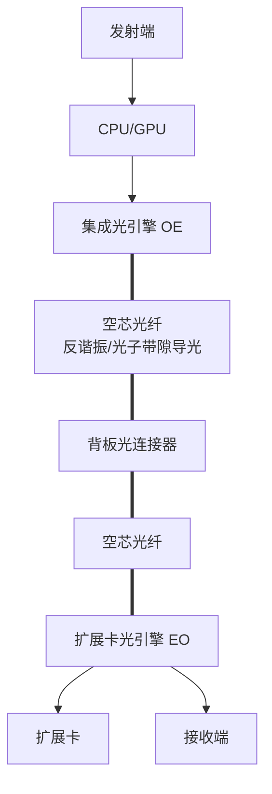
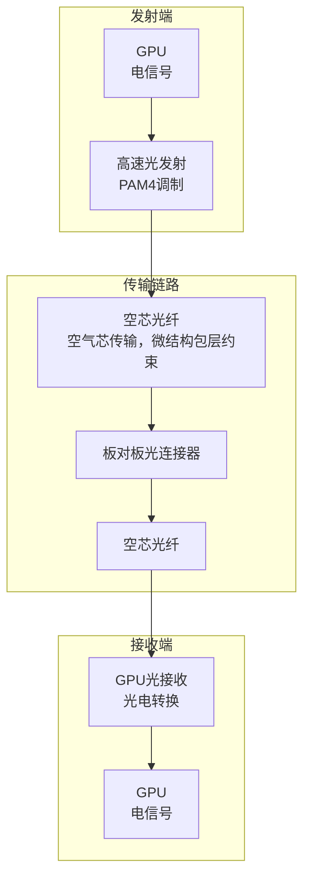

### 一、现阶段服务器连接数据信号的传输方式

近红外（通信主力波段）：750 nm ~ 1600 nm

服务器数据互联按距离和带宽分为三层，核心是**短距电互连、中距光电混合、长距光互连**：

- **服务器内部（cm级）**：主流为**高速铜互连**，信号以电脉冲在PCB/铜缆传输；高端主板/AI加速卡已导入**板上光互连（硅光/集成光引擎）** 试点。
- **机柜内/机架间（<5m）**：**高速铜缆（DAC）** 为主；**高速光模块（SR4/DR4）+多模光纤** 用于25G/100G/400G短距光互连。
- **数据中心内/跨机房（10–1000m）**：**单模光纤+高速光模块** 主流，支持112Gbps/lane、400G/800G/1.6T；硅光与共封装光学（CPO）加速落地。（**Gigabits per second**，吉比特每秒，是**网络 / 光通信的带宽速率单位**）
- **跨数据中心/长距（>1km）**：**单模光纤+相干光模块+DWDM**，100G/400G/800G骨干传输。

### 二、空芯光纤（HCF）在112G/224G/448Gbps+传输中的作用

PAM4等高阶调制**符号速率极高**，对光纤的**色散容忍度、非线性容忍度、损耗、带宽**要求呈指数级提升；

**结论：空芯光纤是下一代超高速（224G/448Gbps+）传输的关键介质，尤其适配PAM4/相干调制，可突破传统光纤的非线性与带宽瓶颈。**

#### 1. 核心优势（适配超高速场景）

- **超低非线性**：非线性系数比实芯光纤低**3–4个数量级**（~0.001 vs 1.3 W⁻¹km⁻¹），彻底消除PAM4/高阶QAM的非线性失真，支持**单波1.2Tbps+**、448Gbps/lane长距传输。
- **低时延（-31%）**：光在空气中传播（~c/1.003），时延3.46μs/km（传统光纤4.9μs/km），AI集群训练、高频交易等场景显著受益。
- **低损耗（0.04dB/km）**：打破实芯光纤0.14dB/km理论极限，减少光放/中继，支持**2000km无中继**传输。
- **超大带宽**：全波段（O/S/E/C/L/U）传输，带宽>1000nm，满足**800G/1.6T/3.2T**超高速光模块需求。

#### 2. 如何发挥作用（下一代传输链路）

- 依靠**空芯结构+空气传输介质+反谐振/光子带隙导光机理**，从根源上避开传统实芯石英光纤的**本征损耗、光学非线性、材料色散、偏振模色散**四大瓶颈
  - 空芯光纤光场在**空气**中传输，**空气非线性折射率远低于石英**，几乎无克尔非线性、四波混频、自相位调制；
  - 允许**更高入纤光功率**，提升链路信噪比，完美适配448Gbps+超高速高阶调制。
  - 空芯光纤依靠微结构设计可实现**宽波段超低平坦色散**，在O/E/S/C/L波段均可做到近零色散；
  - 从原理上**消除固体材料色散主导项**，大幅降低224G/448Gbps信号的色散畸变，无需复杂色散补偿模块。
  - 空芯光纤规避了石英**瑞利散射、红外本征吸收**两大固有损耗；
  - 仅剩余空气散射与结构泄露损耗，**损耗性能优于传统单模光纤**，可实现数据中心长距互联、城域448Gbps无中继传输。**延长高速传输距离*

### 三、四大场景中空芯光纤的适配性与传输原理

#### 1. 高速背板连接器（服务器内部“主干道”）

- **适配性**：**短期难直接替代**（背板空间极小、成本敏感、多为电互连）；长期（224Gbps+）**板上光互连+空芯光纤** 可用于高端AI服务器背板，突破电互连的带宽/串扰瓶颈。

- **传输原理（链路）**：
  


#### 2. 板对板高速连接器（GPU/CPU短距互联）

- **适配性**：**可试点应用**（短距10–50cm、高带宽需求），替代高速铜缆，用于GPU-GPU/CPU-GPU的224G/448Gbps互联，**时延更低、无电磁干扰**。
- **传输原理（链路）**：



#### 3. 光模块连接器（QSFP-DD/OSFP，机架间/跨数据中心）

- **适配性**：**完全适配且是最优方案**（112G/224G/448Gbps+、10m–10km），直接替换单模光纤，**低损耗、低非线性、低时延**，微软/AWS已商用部署。
- **传输原理（链路）**：
  
  ```mermaid
  graph TD
      subgraph 本地端
          S1[服务器<br/>电信号]
          TX[QSFP-DD/OSFP光模块<br/>电→光，PAM4/相干调制]
      end
  
      subgraph 传输链路
          HC[空芯光纤<br/>光信号，超低非线性]
      end
  
      subgraph 对端
          RX[对端QSFP-DD/OSFP光模块<br/>光→电]
          S2[对端服务器<br/>电信号]
      end
  
      S1 --> TX --> HC --> RX --> S2
  
  ```
  
  1. 高速铜缆组件（DAC，<5米短距互连）

- **适配性**：**短期铜缆仍主导**（成本低、易部署、<5米性能足够）；**224Gbps+高频场景**（如英伟达GB200的224G NVLink），空芯光纤**可替代高端DAC**，**带宽更高、时延更低、无串扰**。
- **传输原理（链路）**：
  
  ```mermaid
  flowchart LR
      subgraph 本地端
          GPU1[GPU A]
          TX1[光发射单元 A]
          RX1[光接收单元 A]
      end
  
      subgraph 传输链路
          HC[空芯光纤双向链路<br/>空气芯，<5米]
      end
  
      subgraph 对端
          GPU2[GPU B]
          TX2[光发射单元 B]
          RX2[光接收单元 B]
      end
  
      GPU1 -->|电信号| TX1 -->|光信号| HC
      HC -->|光信号| RX2 -->|电信号| GPU2
      GPU2 -->|电信号| TX2 -->|反向光信号| HC
      HC -->|反向光信号| RX1 -->|电信号| GPU1
  
      style HC fill:#e1f5fe,stroke:#0277bd
  
  ```
  
# 总结

- **内部短距（背板/板对板）**：电互连为主，224Gbps+高端场景逐步导入空芯光纤光互连。
- **中长距（光模块/DCI）**：空芯光纤是下一代超高速（224G/448Gbps+）传输的**最优介质**，已具备商用条件。
- **短距铜缆（DAC）**：成本敏感场景铜缆继续主导，高频高带宽场景空芯光纤可替代。

需要我把以上内容浓缩成一页可直接使用的选型对照表（含适用距离、带宽、成本、成熟度）吗？

# 空芯光纤在112G→224G→448Gbps超高速率传输中的作用及原理分析

## 一、先明确核心前提：高速率传输的瓶颈

当前**112Gbps PAM4**、下一代**224G/448Gbps+超高速光互联**（数据中心、相干通信、短距/长距高速光链路）的核心瓶颈：

1. 传统**实芯石英单模光纤**：折射率色散、非线性效应、传输损耗、时延色散、偏振模色散随速率飙升急剧恶化；
2. PAM4等高阶调制**符号速率极高**，对光纤的**色散容忍度、非线性容忍度、损耗、带宽**要求呈指数级提升；
3. 高频高速下，实芯光纤**光场在石英介质中传输**，受材料本征吸收、瑞利散射、克尔非线性、四波混频限制极大。

**结论先行**：**空芯光纤（HC-ARF/HC-PBG等）完全可以发挥关键核心作用**，是224G/448Gbps及更下一代超高速率传输的理想介质。

---

## 二、空芯光纤基础原理（结构、材料、光学原理、核心性能）

### 1. 基本结构

空芯光纤**中心为空气孔（空芯）**，光场**主要在空气芯中传输**，而非固体介质；包层为**微结构光子晶体/反谐振环形包层**，典型两类：

- **反谐振空芯光纤 HC-ARF**：包层由多层离散玻璃圆环构成，依靠**反谐振导光**束缚光场在空气芯；
- **光子带隙空芯光纤 HC-PBG**：包层周期性蜂窝微结构，利用光子带隙效应限制光外泄。

通用结构：**空气芯（传输主通道）+ 微结构玻璃包层 + 外包层涂覆层**。

### 2. 材料体系

- 传输介质：**空气（99%以上光场在空气传播）**；
- 结构材料：纯石英玻璃（SiO₂），仅作为**包层束缚结构**，不承担主要光传输；
- 无掺杂、无稀土，仅石英+空气，规避固体介质本征损耗与非线性。

### 3. 光学导光原理

1. **实芯光纤**：依靠**全反射**，光场束缚在高折射率石英芯，全程在固体介质传播；
2. **空芯光纤**：
    - HC-ARF：**反谐振反射原理**——包层玻璃环的谐振波长与工作波长错开，对传输光形成高反射壁垒，把光禁锢在空气芯；
    - HC-PBG：**光子带隙原理**——包层周期性微结构形成光子禁带，禁止光向包层泄露，仅在空气芯导光。
    核心本质：**光不在固体玻璃里走，在空气里走**。

### 4. 核心关键性能（对比传统实芯光纤）

| 性能维度 | 传统实芯单模光纤 | 空芯光纤 |
|----------|------------------|----------|
| 传输介质 | 石英固体 | 空气为主 |
| 传输损耗 | 瑞利散射本征损耗高 | 空气损耗极低，远低于实芯 |
| 非线性效应 | 强（克尔效应、四波混频、自相位调制） | **极弱**（空气非线性折射率比石英低3个数量级） |
| 色散特性 | 材料色散+波导色散，高速下色散畸变严重 | 色散可控、超低色散、宽波段平坦色散 |
| 偏振模色散PMD | 随速率升高劣化明显 | 超低PMD，偏振稳定性极好 |
| 时延、信号畸变 | 高阶调制易码间干扰 | 信号时域畸变极小 |
| 功率承受能力 | 固体易非线性饱和、光损伤 | 空气可承受更高光功率，无介质热效应 |

---
